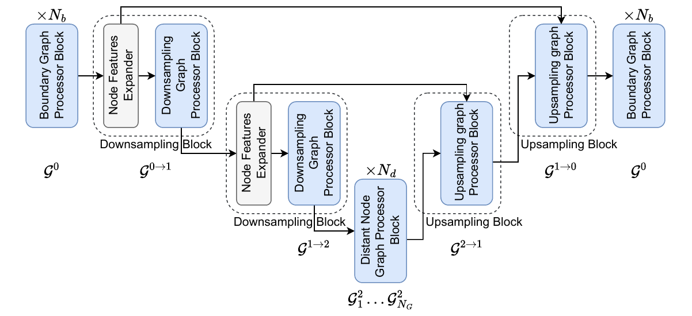

<div align="center">
<h2>PIBNet: a Physics-Inspired Boundary Network for Multiple Scattering Simulations
</h2>

<br>

<div align="center">
<table style="margin:0 auto;border-collapse:collapse;">
    <tr>
        <td style="text-align:center;padding:0 1rem;"><strong>Rémi Marsal</strong></td>
        <td style="text-align:center;padding:0 1rem;"><strong>Stéphanie Chaillat</strong></td>
    </tr>
    <tr>
        <td style="text-align:center;padding:0 1rem;">U2IS, ENSTA<br>Institut Polytechnique de Paris</td>
        <td style="text-align:center;padding:0 1rem;">Laboratoire POEMS, CNRS, INRIA, ENSTA<br>Institut Polytechnique de Paris</td>
    </tr>
</table>
</div>

<br>



<br>

</div>

This repository contains the official implementation of the paper [**PIBNet**](https://openreview.net/forum?id=MiYStkjrfo) and its [improvement](https://openreview.net/forum?id=kex0P2KMsZ) accepted at the **1st Workshop on Differentiable Systems and Scientific Machine Learning @ EurIPS 2025**.

## Installation

Clone repository and install libraries in `requirements.txt`. Please refer to [DGL installation page](https://www.dgl.ai/pages/start.html) to install `dgl`.

## Generate Datasets

```
sh scripts/gen_laplace_dirichlet.sh
sh scripts/gen_helmholtz_dirichlet.sh
sh scripts/gen_helmholtz_neumann.sh
```

## PIBNet

### Training

```
sh scripts/train_pibnet.sh
```

### Testing

```
sh scripts/test_pibnet.sh
```

## PIBNet improvement

### Training

```
sh scripts/train_improved_pibnet.sh
```

### Testing

```
sh scripts/test_improved_pibnet.sh
```

## Acknowledgement

We would like to thank the authors of [Multiscale Neural Operators for Solving Time-Independent PDEs](https://openreview.net/forum?id=ihbEbWpaaF) for their great work and for sharing their [code](https://github.com/merantix-momentum/multiscale-pde-operators) and the authors of the [NVIDIA PhysicsNeMo](https://docs.nvidia.com/physicsnemo/latest/physicsnemo/api/models/gnns.html) implementation of [MeshGraphNet](https://arxiv.org/abs/2010.03409).
